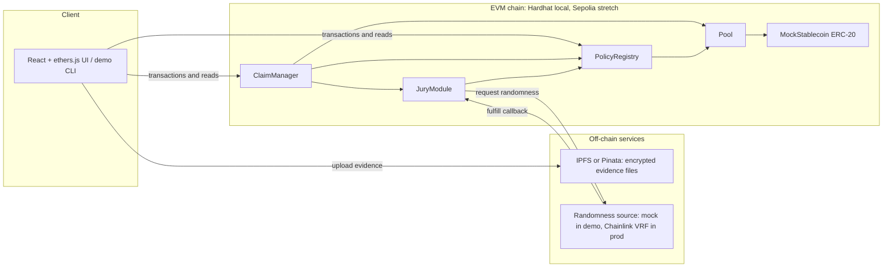
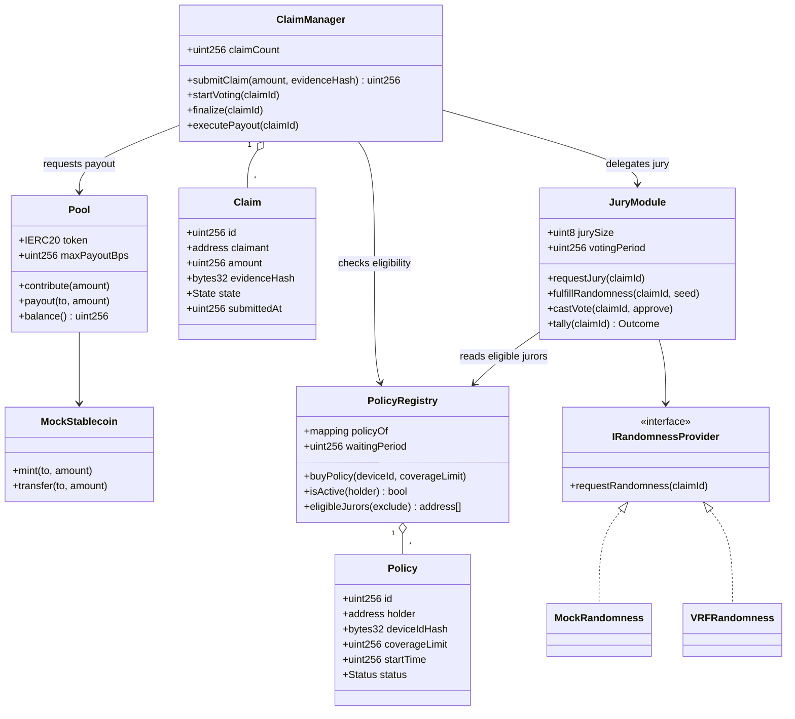
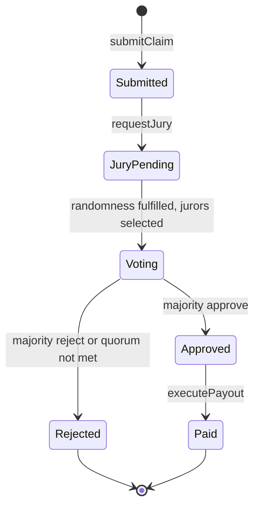
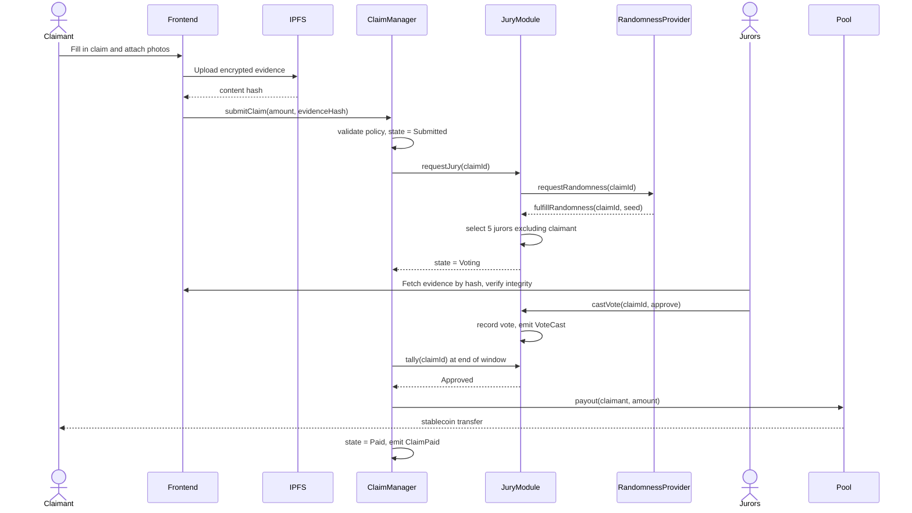

# P2P Device Insurance: System Design Document (Milestone 2)

## 1. Overview

A peer-to-peer device insurance protocol on an EVM blockchain. Policyholders contribute stablecoin to a shared pool. When a policyholder files a claim, a randomly selected jury of other policyholders votes on it. If the jury approves, the pool pays out. Payments and votes are recorded on-chain as an immutable audit trail.

**Goals for this milestone:** one working happy-path claim flow, end to end, on a local network.

**Non-goals (see Section 10):** production-grade randomness, Sybil resistance, commit-reveal voting, appeals, solvency modeling, regulatory structure.

## 2. Architecture at a Glance

The system has three layers: a client, a set of on-chain contracts, and off-chain services for evidence storage and randomness.



### Why this shape

- **Separate contracts by responsibility.** Money (Pool), membership (PolicyRegistry), claim workflow (ClaimManager), and jury logic (JuryModule) each change for different reasons. Keeping jury logic separate means we can swap in a better selection or voting scheme without touching the contract that holds funds.
- **Only the Pool moves money.** Every other contract has zero token custody, which shrinks the attack surface and makes audits easier.
- **Evidence stays off-chain.** Only a content hash goes on-chain. This keeps gas low, avoids putting personal data on an immutable ledger, and lets jurors verify the file has not been altered since submission.
- **Randomness is behind an interface.** The demo uses a mock; production swaps in Chainlink VRF with no changes to JuryModule.

## 3. Component Responsibilities

| Component | Responsibility | Holds funds? |
|---|---|---|
| **MockStablecoin** | ERC-20 for the demo; stands in for USDC | n/a |
| **PolicyRegistry** | Creates policies, tracks status (Active, Lapsed), enforces one policy per wallet, exposes the eligible-juror list | No |
| **Pool** | Accepts contributions, holds the stablecoin, executes payouts (callable only by ClaimManager) | **Yes** |
| **ClaimManager** | Owns the claim state machine, validates eligibility, triggers jury selection, finalizes outcomes, requests payout | No |
| **JuryModule** | Requests randomness, selects jurors, records votes, tallies the result | No |
| **IRandomnessProvider** | Interface: `requestRandomness(claimId)`. Implementations: `MockRandomness` (demo), `VRFRandomness` (future) | No |
| **Frontend / CLI** | Wallet connection, evidence upload, claim submission, voting, status views | n/a |

## 4. Data Model



## 5. Claim Lifecycle



**Transition rules**

| Transition | Guard |
|---|---|
| Submit | Policy is Active, waiting period elapsed, amount at most the coverage limit, no other open claim on this policy |
| Submitted to JuryPending | Called by ClaimManager after submission |
| JuryPending to Voting | Only the randomness provider can call the fulfill callback |
| Vote | Caller is a selected juror, has not voted, voting window still open |
| Finalize | Voting window ended or all jurors voted; simple majority of 5 wins; fewer than 3 votes cast counts as no quorum and is rejected |
| Paid | Payout amount is the minimum of the claim amount, the coverage limit, and the per-claim pool cap (`maxPayoutBps`) |

## 6. Main Flow



## 7. Key Design Decisions

| Decision | Choice | Rationale | Alternative considered |
|---|---|---|---|
| Contract structure | 4 focused contracts | Separation of concerns, upgrade path, easier testing | One monolith: simpler, but tangled and harder to audit |
| Fund custody | Pool only | Smallest attack surface | Escrow per claim: more gas and complexity |
| Randomness | Interface with mock, VRF later | Deterministic tests now, real randomness later | Blockhash: manipulable by validators |
| Jury selection | Fisher-Yates style sampling on the eligible list, seeded by the randomness output | Simple and auditable; fine for a small demo pool | Off-chain selection: cheaper but requires trusting the selector |
| Voting | Plain on-chain vote | Fast to build and easy to demo | Commit-reveal: prevents herding, listed as future work |
| Evidence | Hash on-chain, file on IPFS | Cheap, tamper-evident, privacy-friendlier | Full on-chain storage: expensive and permanently public |
| Token | Mock ERC-20 | Free and controllable for demos | Real USDC on testnet: extra setup with little benefit at this stage |
| Access control | OpenZeppelin `Ownable` and role checks between contracts | Battle-tested primitives | Custom modifiers: more bug risk |

## 8. Trust Assumptions and Threats (Prototype)

| Threat | Prototype mitigation | Production plan |
|---|---|---|
| One person creates many wallets to dominate juries | One policy per wallet, waiting period | Identity or device attestation, stake-weighted selection |
| Claimant sits on their own jury | Claimant excluded from selection | Also exclude linked accounts |
| Jurors copy each other's votes | None (accepted) | Commit-reveal voting |
| Randomness is predicted or gamed | Mock only, clearly labeled | Chainlink VRF |
| Pool drained by a single large claim | Coverage limit and `maxPayoutBps` cap | Solvency modeling, reserve ratios, pro-rata payouts |
| Reentrancy on payout | Checks-effects-interactions, OpenZeppelin `ReentrancyGuard` | External audit |
| Non-voting jurors stall a claim | Voting deadline and quorum rule | Slash non-voters, replace with fresh jurors |

## 9. Testing and CI

- **Unit tests** (Hardhat + Chai) per contract, covering guards and state transitions.
- **Integration test** that runs the full happy path: join, contribute, submit, vote, payout.
- **Negative tests:** ineligible claimant, double vote, non-juror vote, voting after deadline, payout above cap.
- **CI (GitHub Actions):** install dependencies, compile, run tests, lint (Solhint and ESLint). Branch protection requires a green run before merge.

## 10. Limitations and Future Work

These are known gaps, deliberately left out of the prototype.

1. **Commit-reveal voting** to stop herding and bribery
2. **Appeals** with escalating jury sizes
3. **Juror incentives:** fees, coherence rewards, and penalties for non-voters
4. **Real randomness** via Chainlink VRF or drand
5. **Sybil resistance:** identity checks or device attestation (IMEI, Apple and Google attestation)
6. **Claimant bond** forfeited on fraudulent claims
7. **Solvency modeling:** reserve ratios, pro-rata payouts on shortfall, withdrawal lockups
8. **Gas-efficient jury selection** for large pools (off-chain selection with on-chain proof)
9. **Evidence encryption and access control** so only selected jurors can decrypt
10. **Regulatory structure**, since this resembles insurance in most jurisdictions (a discretionary-mutual model is one path)
11. **Upgradeability,** timelocks, and an emergency pause

## 11. Repository Layout

```
/contracts
  MockStablecoin.sol
  PolicyRegistry.sol
  Pool.sol
  ClaimManager.sol
  JuryModule.sol
  interfaces/IRandomnessProvider.sol
  mocks/MockRandomness.sol
/test
  integration/happyPath.test.js
  unit/*.test.js
/scripts
  deploy.js
  demo.js
/frontend
/docs
  design-doc.md
  tech-stack-justification.md
/.github/workflows
  ci.yml
```
